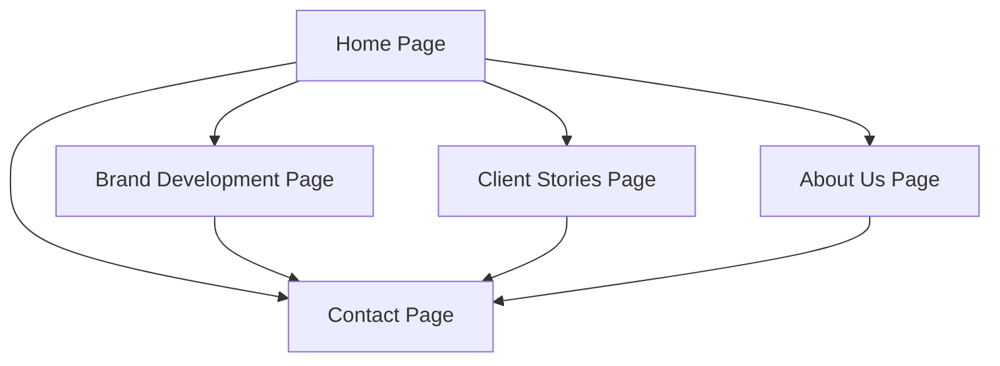

## 1. Product Overview
Design Space is a premium interior design company website that showcases sophisticated design services and brand growth consulting. The website serves as a digital portfolio and client acquisition platform, emphasizing luxury, spaciousness, and professional authority while maintaining approachable warmth.

Target audience: High-end residential and commercial clients seeking premium interior design services, plus businesses requiring brand development consulting. The website establishes credibility and trust while conveying the company's caring, integrity-driven approach to transforming spaces and brands.

## 2. Core Features

### 2.1 User Roles
No user registration required - this is a static showcase website with contact form functionality.

### 2.2 Feature Module
The Design Space website consists of the following main pages:
1. **Home page**: Full-screen hero section, services introduction, featured projects showcase, client testimonials, call-to-action.
2. **Brand Development page**: Service overview, benefits explanation, case studies showcase, professional consultation invitation.
3. **Client Stories page**: Portfolio grid, project descriptions, category filtering, transformation highlights.
4. **About Us page**: Company story, team presentation, values showcase, milestone timeline.
5. **Contact page**: Contact form, location information, direct contact details, submission confirmation.

### 2.3 Page Details
| Page Name | Module Name | Feature description |
|-----------|-------------|---------------------|
| Home page | Hero section | Display full-screen interior design image with headline overlay, subtle background animations, and immediate visual impact. |
| Home page | Services introduction | Present interior design and brand development services with professional, caring tone and compelling copy. |
| Home page | Featured projects | Showcase 3-6 premium project thumbnails in grid or carousel format with hover effects. |
| Home page | Testimonials | Display 2-3 client quotes emphasizing trust, quality, and transformational results. |
| Home page | Call-to-action | Prominent "Get Started" button linking to Contact page with conversion-focused placement. |
| Brand Development page | Service hero | Full-width brand mood board image with headline about purposeful brand growth. |
| Brand Development page | Service explanation | Detail branding consultations, visual identity services, and strategic design approach. |
| Brand Development page | Benefits showcase | Highlight authority building, market positioning, and integrity-focused brand development. |
| Brand Development page | Case studies | Present 2-3 brand transformation examples with before/after visualizations. |
| Client Stories page | Portfolio hero | "Our Transformations" headline with premium project photography backdrop. |
| Client Stories page | Project grid | Masonry or uniform grid layout displaying project thumbnails with titles and brief descriptions. |
| Client Stories page | Category filtering | Allow filtering by project type: residential, commercial, brand growth. |
| Client Stories page | Project details | Individual project pages with full descriptions, multiple images, and outcome highlights. |
| About Us page | Company hero | Team photo or abstract design image with "Who We Are" headline. |
| About Us page | Company story | Narrative about mission, approach, and commitment to client transformation. |
| About Us page | Team bios | Professional yet approachable team member profiles with photos and expertise areas. |
| About Us page | Values showcase | Integrity, trust, and excellence values with supporting visual elements. |
| About Us page | Timeline | Company milestones and achievements presented chronologically. |
| Contact page | Contact hero | Warm, inviting image with "Let's Connect" headline. |
| Contact page | Contact form | Simple form with name, email, message fields and "How can we help?" prompt. |
| Contact page | Location info | Map placeholder showing Johannesburg location with address details. |
| Contact page | Direct contact | Display phone number, email address, and business hours. |
| Contact page | Confirmation | Success message after form submission with next steps communication. |

## 3. Core Process
Users navigate through the website to explore Design Space's services, view portfolio examples, learn about the company, and initiate contact. The primary flow begins at the Home page where visitors are introduced to the brand through impactful visuals and service overview. From there, users can explore specific service offerings (Brand Development), review past work (Client Stories), understand the company philosophy (About Us), or directly reach out (Contact).

The website emphasizes visual storytelling and builds trust through consistent messaging, high-quality imagery, and professional presentation. Each page reinforces the premium positioning while maintaining accessibility and warmth.

## 4. User Interface Design

### 4.1 Design Style
- **Primary Colors**: Beige (#F5F5DC), White (#FFFFFF), Grey (#808080)
- **Accent Colors**: Soft taupe (#8B8589), Light cream (#FFFDD0), Muted charcoal (#36454F)
- **Typography**: 
  - Headlines: Baskerville Display PT (fallback: Georgia, serif)
  - Subheadings: Futura (fallback: Helvetica, sans-serif)
  - Body text: Arial MT Pro (fallback: Arial)
- **Button Style**: Rounded corners, subtle shadows, hover animations
- **Layout Style**: Full-width sections, generous white space, card-based content organization
- **Icon Style**: Minimalist line icons, neutral colors, consistent stroke weight

### 4.2 Page Design Overview
| Page Name | Module Name | UI Elements |
|-----------|-------------|-------------|
| Home page | Hero section | Full-screen background image with gradient overlay, large headline in Baskerville Display PT (48-64px), subheading in Futura (24-32px), subtle particle animation background. |
| Home page | Services section | Three-column layout with icon-based service cards, beige background with white content cards, 24px body text in Arial MT Pro. |
| Home page | Projects showcase | Masonry grid with 16:9 aspect ratio thumbnails, hover zoom effect, project titles in Baskerville (24px), subtle drop shadows. |
| Brand Development page | Service overview | Split-screen layout with image left/content right, bullet points in Arial (18px), accent taupe highlights, professional photography. |
| Client Stories page | Portfolio grid | Responsive grid (3 columns desktop, 2 tablet, 1 mobile), filter buttons with active state styling, project cards with overlay effects. |
| About Us page | Team section | Circular team photos with bio overlays, timeline with connecting lines, values displayed in icon-based cards with cream backgrounds. |
| Contact page | Form section | Clean white form fields with beige focus states, large message textarea, prominent submit button with hover animation. |

### 4.3 Responsiveness
Desktop-first design approach with mobile adaptation. Breakpoints: Desktop (1200px+), Tablet (768px-1199px), Mobile (320px-767px). Touch optimization for mobile devices with appropriately sized tap targets and swipe-friendly carousels.

### 4.4 Animations and Interactions
Subtle fade-in animations on scroll, gentle hover effects on interactive elements, smooth transitions between sections. Background animations include ethereal particle effects and soft wave patterns that create calm, flowing movement without distraction.