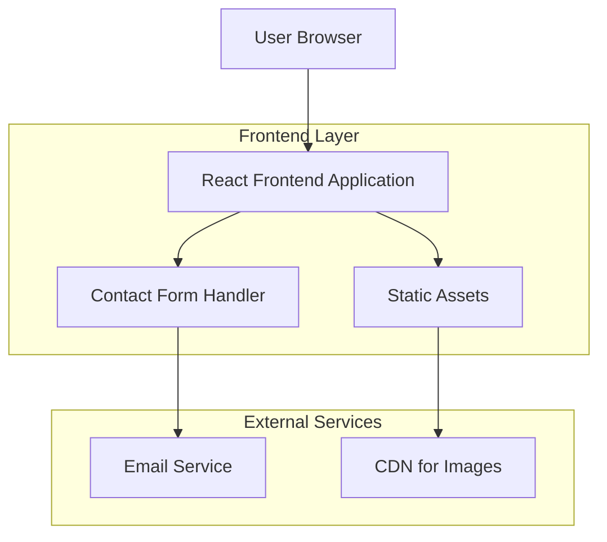

## 1. Architecture Design



## 2. Technology Description

- **Frontend**: React@18 + tailwindcss@3 + vite
- **Initialization Tool**: vite-init
- **Backend**: None (static site with client-side contact form)
- **Styling**: Tailwind CSS for utility-first styling
- **Animations**: CSS animations and transitions, intersection observer for scroll effects
- **Image Optimization**: WebP format with fallbacks, lazy loading
- **Deployment**: Static hosting (Netlify, Vercel, or similar)

## 3. Route Definitions

| Route | Purpose |
|-------|---------|
| / | Home page, main landing with hero section and service overview |
| /brand-development | Brand development services page with case studies |
| /client-stories | Portfolio showcase with project gallery and filtering |
| /about | Company information, team bios, and values |
| /contact | Contact form and location information |

## 4. Component Architecture

### 4.1 Core Components
- **Header**: Fixed navigation with responsive mobile menu
- **HeroSection**: Full-screen hero with background image and text overlay
- **ProjectCard**: Reusable card for portfolio items with hover effects
- **TestimonialCard**: Client quote display with attribution
- **ContactForm**: Form validation and submission handling
- **Footer**: Social media links and contact information

### 4.2 Layout Components
- **PageLayout**: Wrapper for consistent page structure
- **Section**: Reusable section container with padding and background options
- **Container**: Responsive content container with max-width constraints

## 5. Performance Optimization

### 5.1 Image Optimization
- Use Next.js Image component or custom lazy loading implementation
- WebP format with JPEG/PNG fallbacks
- Responsive images with srcset for different screen sizes
- Image compression targeting 80-85% quality

### 5.2 Code Splitting
- Route-based code splitting using React.lazy()
- Component-level splitting for heavy components
- Preload critical resources

### 5.3 Caching Strategy
- Browser caching for static assets (1 year)
- Service worker for offline functionality (optional)
- CDN integration for global asset delivery

## 6. SEO and Accessibility

### 6.1 SEO Implementation
- Semantic HTML structure
- Meta tags for title, description, and Open Graph
- Structured data for business information
- XML sitemap generation
- robots.txt configuration

### 6.2 Accessibility Features
- ARIA labels for interactive elements
- Keyboard navigation support
- Screen reader friendly content structure
- Color contrast compliance (WCAG 2.1 AA)
- Focus indicators for interactive elements

## 7. Development Workflow

### 7.1 Build Process
- Development: Vite dev server with hot reload
- Production: Vite build with optimization
- Testing: Manual testing across devices and browsers
- Deployment: Static file hosting

### 7.2 File Structure
```
src/
├── components/
│   ├── common/
│   ├── layout/
│   └── pages/
├── assets/
│   ├── images/
│   ├── fonts/
│   └── styles/
├── utils/
├── hooks/
└── App.jsx
```

## 8. Browser Support

- Chrome/Edge (latest 2 versions)
- Firefox (latest 2 versions)
- Safari (latest 2 versions)
- Mobile browsers (iOS Safari, Chrome Android)
- Progressive enhancement for older browsers

## 9. Contact Form Implementation

Since no backend is specified, implement client-side contact form with:
- Form validation (name, email format, message length)
- Client-side submission simulation
- Success/error state management
- Optional: Integration with email service (EmailJS or similar)
- Spam protection through honeypot fields

## 10. Future Enhancement Considerations

- Blog/CMS integration (headless CMS like Contentful)
- E-commerce functionality for design products
- Client portal for project management
- Multi-language support
- Advanced analytics integration